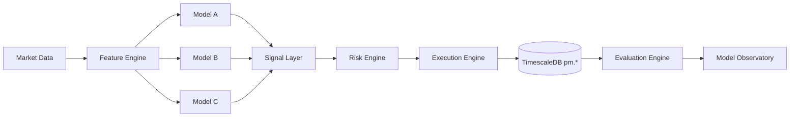

# V2.7 Roadmap — Intelligent Trading System & Competitive Model Fleet

## Overview

This document defines the roadmap from the current state (**v2.0 — Polymarket V1 complete**) to **v2.7**, where Caliper evolves into a **competitive, multi-model trading system** capable of:

* Running multiple autonomous models ("fleet")
* Competing for capital allocation based on performance
* Extracting signal from market + wallet behavior
* Adapting over time via feedback loops

This phase builds on:

* Existing **ML + execution + observability stack** 
* Existing **Polymarket service (market making + telemetry)** 
* Research layers (microstructure, probabilities, regime, reward density, cross-sectional)

---

# 🎯 End State Vision (v2.7)

A system where:

### 1. Models compete like traders

* Each model:

  * Has its own strategy, features, and risk profile
  * Trades independently (paper or small capital)
  * Is evaluated continuously

### 2. Capital is dynamically allocated

* Better-performing models receive more capital
* Poor performers are downweighted or retired

### 3. Signals are multi-layered

* Market microstructure
* Probabilistic forecasts
* Wallet intelligence (future integration)
* Regime detection

### 4. System is adaptive

* Models evolve
* Signals decay detection
* Continuous validation + retraining

---

# 🧭 Roadmap Structure

We move through 3 major steps:

| Step       | Focus                 | Outcome                                 |
| ---------- | --------------------- | --------------------------------------- |
| **Step 2** | System + Architecture | Environment to build intelligent models |
| **Step 3** | Model Fleet (v1)      | 3–5 competing live models               |
| **Step 4** | Expansion Layer       | Signals, intelligence, optimization     |

---

# 🧱 STEP 2 — SYSTEM FOUNDATION (1–2 Sprints)

## Objective

Build the **environment where models can be created, tested, and compete**.

This is NOT about better strategies yet — it's about **building the arena**.

---

## 2.1 Model Abstraction Layer

### Goal

Unify how all models plug into the system.

### Requirements

Each model must define:

```python
class Model:
    def predict(context) -> Signal
    def size(signal, context) -> Position
    def risk_check(position) -> Decision
```

### Extensions

* Confidence score
* Abstain capability (already exists)
* Feature attribution (SHAP / logs)

---

## 2.2 Unified Signal Interface

All strategies must output:

```ts
Signal {
  direction: "YES" | "NO" | "NONE"
  confidence: float
  urgency: float
  source: string
}
```

This enables:

* Cross-model comparison
* Ensemble building
* Signal stacking

---

## 2.3 Feature Layer Unification

Leverage research files:

* `probabilities.md`
* `microstructure-model.md`
* `cross-sectional.md`
* `regime-allocation.md`
* `reward-density.md`

### Feature Categories

#### 1. Market State

* Mid price
* Spread
* Orderbook imbalance
* Time-to-close

#### 2. Microstructure

* Adverse selection
* Toxic flow
* Queue position
* Fill quality

#### 3. Probabilistic

* Implied probability vs fair probability
* Drift vs baseline

#### 4. Regime

* Trending vs mean reverting
* Volatility state
* Late-hour vs early-hour behavior

---

## 2.4 Evaluation Engine (CRITICAL)

This is the **core of the system**.

### Metrics per model:

* PnL
* Sharpe-like ratio
* Win rate
* Max drawdown
* Consistency score
* Regime performance breakdown

### Add:

* Rolling windows (avoid overfitting)
* Regret vs baseline
* Stability metrics

This extends existing backtesting + observability systems 

---

## 2.5 Simulation Layer (Bridge to Reality)

Before live fleet:

* Replay historical markets
* Simulate execution
* Compare models side-by-side

---

## 2.6 System Architecture (Updated)



---

# 🤖 STEP 3 — MODEL FLEET V1 (1–3 Sprints)

## Objective

Deploy **3–5 competing models trading in real-time (paper or dust capital)**.

---

## 3.1 Fleet Composition (Recommended)

### Model 1 — Microstructure Maker (Baseline)

* Current Polymarket V1 evolution
* Focus:

  * Spread capture
  * Inventory control
* Strength:

  * Stable, consistent

---

### Model 2 — Directional Probability Model

* Uses:

  * Price movement prediction
  * Time-to-close dynamics
* Output:

  * YES / NO directional bets

---

### Model 3 — Hybrid Model

* Combines:

  * Microstructure + probability
* Example:

  * Only quote aggressively when directional edge exists

---

### Model 4 — Regime-Aware Model

* Switches strategies based on:

  * Volatility
  * Time decay
  * Market behavior

---

### Model 5 (Optional) — Experimental / RL

* Reinforcement learning or adaptive logic
* High variance, high upside

---

## 3.2 Fleet Execution Design

Each model:

* Runs independently
* Has its own:

  * Positions
  * PnL tracking
  * Risk limits

---

## 3.3 Fleet Evaluation

Introduce:

### Model Ranking Table

| Model | PnL | Sharpe | Win Rate | Stability | Rank |
| ----- | --- | ------ | -------- | --------- | ---- |

---

## 3.4 Capital Allocation (Initial)

Start simple:

* Equal allocation

Then evolve to:

* Performance-weighted allocation

---

## 3.5 Observability Expansion

Extend Model Observatory:

* Per-model dashboards
* Signal logs
* Trade attribution
* Regime breakdown

Already aligned with existing observability system 

---

# 🚀 STEP 4 — EXPANSION LAYER (2–5+ Sprints)

## Objective

Turn the system from “working” → **edge-generating**

---

## 4.1 Wallet Intelligence Integration

From your earlier spec:

### Build:

* Wallet-level dataset:

  * Trades
  * Positions
  * PnL

### Extract:

* Top traders
* Behavioral clusters

### Signals:

* “Top wallets net buying”
* “Consensus among smart money”

---

## 4.2 Signal Aggregation Layer

Combine:

```text
Final Signal =
  w1 * model_signal
+ w2 * wallet_signal
+ w3 * microstructure_signal
```

---

## 4.3 Latency + Copyability Layer

Evaluate:

* Is signal leading?
* Is edge still there after delay?

---

## 4.4 Adaptive System

Introduce:

### Model Lifecycle

* Promote
* Pause
* Retire
* Clone

### Continuous Learning

* Retrain models
* Update features
* Detect decay

---

## 4.5 Advanced Risk Layer

Extend current risk system:

* Per-model risk budgets
* Fleet-level drawdown control
* Dynamic exposure scaling

---

## 4.6 Strategy Optimization Engine

* Hyperparameter tuning
* Feature selection
* Strategy mutation

---

# 📊 Final Outputs (v2.7)

## 1. Wallet Ranking Table

* Top traders
* Performance metrics
* Clusters

## 2. Model Ranking Table

* Fleet performance
* Stability scores

## 3. Signal Definitions

* Clear, composable signals

## 4. Backtest Results

* Historical validation
* Regime performance

## 5. Integration Plan

* How signals feed execution

---

# ⚖️ Key Design Principles

## 1. Data-first

Everything must be measurable.

## 2. Paper-first

No scaling before validation.

## 3. Competition-driven

Models compete, system selects winners.

## 4. Robust over clever

Avoid overfitting and fragile edges.

---

# 🧠 Strategic Insight

This roadmap transitions Caliper from:

### “A trading bot”

➡️

### “A competitive intelligence system for markets”

Where:

* Models are agents
* Signals are assets
* Performance determines survival

---

# ⏱️ Estimated Timeline

| Step   | Duration     |
| ------ | ------------ |
| Step 2 | 1–2 sprints  |
| Step 3 | 1–3 sprints  |
| Step 4 | 2–5+ sprints |

---

# 🔚 Conclusion

By v2.7, the system should:

* Run multiple competing models
* Extract signal from both **market + participants**
* Adapt and improve over time
* Provide a real, testable edge

This is the foundation for scaling into:

* Larger capital
* More markets
* Fully autonomous trading systems
