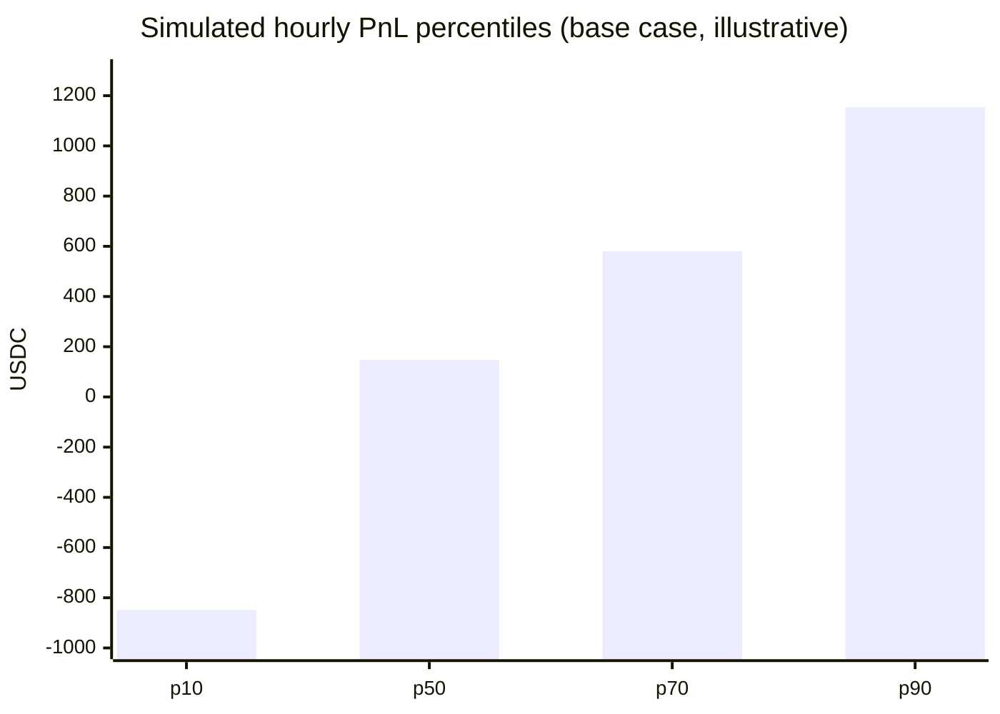
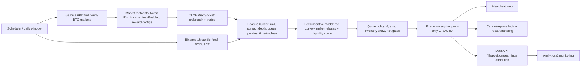

# Fee-Curve-Aware Microstructure Model for Polymarket Hourly BTC Up/Down Markets

## Executive summary

Hourly BTC “Up/Down” markets resolve mechanically: “Up” if the **close price ≥ open price** for the **BTC/USDT 1‑hour candle** on entity["company","Binance","crypto exchange"] for the hour stated in the market title; otherwise “Down.” citeturn6search0turn6search3turn10search25 This means the *terminal* payoff is binary, but the *intrahour* “fair value” behaves like a time-to-expiry digital claim on whether BTC finishes the hour above its open—so market microstructure (spread, queue position, toxic flow near close) dominates realized outcomes.

Polymarket’s trading stack is a hybrid system: orders are created offchain and matched in a CLOB, while settlement happens onchain. citeturn5search0turn21view0 All orders are limit orders; “market orders” are just aggressively priced limit orders. citeturn5search0turn21view0 Post-only orders are explicitly supported and keep you maker by rejecting orders that would cross the spread, which is foundational to any maker-leaning strategy that wants to avoid taker fees. citeturn21view0

From **Jan–Mar 2026**, the economics for a maker-leaning bot in fee-enabled crypto markets are driven by three PnL components: (a) *spread capture* on fills, (b) *inventory drift/adverse selection* (the main failure mode, especially near hour close), and (c) *incentives*—maker rebates funded by taker fees and liquidity rewards paid daily based on “quote quality.” citeturn19view0turn15view0turn7view1 Modeling “toxic flow” near hour close is essential because as the candle outcome becomes more observable, marketable order flow becomes more directional, a standard result in limit-order-book market making models with informed flow. citeturn12search1

Key platform specifics your model must encode (Jan–Mar 2026 focus):
- **Coverage timing for hourly crypto**: starting **March 6, 2026**, taker fees and maker rebates extend to all crypto markets **including 1H**, and **only new markets created after March 6 are affected**. citeturn20view0  
- **Current crypto fee curve (pre‑Mar 30, 2026)**: crypto taker fee parameters are documented as **feeRate = 0.25** and **exponent = 2**, peaking around **1.56%** near 50% probability. citeturn7view1turn20view0  
- **March 30, 2026 update**: docs state new fee parameters take effect **March 30, 2026** and provide the fee formula; for crypto this becomes **feeRate = 0.072** and **exponent = 1** (peak effective rate ~1.80%). citeturn7view1  
- **Maker rebates**: funded by taker fees; “Crypto” rebates are documented as **20%** fee-curve weighted, computed per market, and paid daily in USDC (with the rate explicitly noted as discretionary and subject to change). citeturn19view0turn20view0  
- **Liquidity rewards**: paid daily at **midnight UTC**, computed from a minute-sampled scoring function that prefers tight spreads and balanced books (the approach is described as inspired by entity["organization","dYdX Foundation","defi protocol foundation"]’s LP rewards methodology). citeturn15view0  
- **Operational constraints**: heartbeat cancels all open orders if liveness is lost, weekly restart returns HTTP 425, and rate limits are enforced using entity["company","Cloudflare","web security company"] throttling (often delaying/queuing requests rather than clean 429 rejects). citeturn21view0turn22view0turn23view0  

A stylized Monte Carlo microstructure simulation (illustrative, not predictive) shows the central tradeoff: *average* hourly PnL can be positive under an inventory-capped maker policy, but the distribution is wide; “70th percentile” performance is dominated by (1) maker share/queue position and (2) hourly market volume, with fee-curve-driven incentives as a meaningful but secondary additive.

## Assumptions and inputs

This section makes the modeling assumptions explicit so the model can be audited and improved.

**Market definition and settlement alignment**
- Each hourly BTC Up/Down market resolves from the referenced BTC/USDT 1‑hour candle: Up if close ≥ open, Down otherwise. citeturn6search0turn10search25  
- Terminal payouts are binary (winning tokens redeem for 1, losing redeem for 0) and resolution is tied to the market’s onchain “closed/winner” state. citeturn24view0turn10search25  

**Fee curve (Jan–Mar 2026) and the March 30 update**
- Fees apply only when a market is fee-enabled (`feesEnabled = true`), and you can query fee rates via the API. citeturn7view1turn19view0turn23view0  
- Current crypto fee parameters (pre‑Mar 30): feeRate 0.25 and exponent 2 (peak ≈1.56% at 50%). citeturn7view1turn20view0  
- Effective Mar 30, 2026: the fee formula is documented as  
  `fee = C × p × feeRate × (p × (1 − p))^exponent`,  
  and crypto moves to feeRate 0.072 and exponent 1. citeturn7view1turn19view0  
- Fees are calculated in USDC but collected in shares on buys and USDC on sells. citeturn7view1turn19view0  
- Coverage timing: hourly crypto (1H) markets become fee/rebate-enabled for new markets created after Mar 6, 2026. citeturn20view0  

**Maker rebates rules**
- Maker rebates are paid daily in USDC to liquidity providers and are performance-based (your liquidity must be taken). citeturn19view0  
- Crypto maker rebate is documented as 20%, fee-curve weighted, computed per market; the rate is discretionary and may change. citeturn19view0  
- Fee-equivalent and rebate formulae are explicitly documented, including per-market competition. citeturn19view0turn20view0  

**Liquidity rewards rules**
- Rewards are paid daily at midnight UTC and computed from a per-market scoring system using max spread and min size. citeturn15view0turn23view0  
- The documentation describes sampling (Q calculated every minute; epoch uses 10,080 samples) and a two-sided score via \(Q_{\min}\). citeturn15view0  

**Orderbook and execution mechanics**
- All orders are limit orders; post-only behavior is: rejected if marketable, usable only with GTC/GTD. citeturn5search0turn21view0  
- Tick size is market-specific and enforceable; bad tick sizes are rejected. citeturn21view0turn23view0  
- Midpoint price is derived from the best bid/ask; if spread exceeds $0.10 the UI uses last trade price. citeturn9search1turn9search3  

**Heartbeat / cancel rules**
- If a valid heartbeat is not received within 10 seconds (with up to 5-second buffer), all open orders are cancelled. citeturn21view0  

**Weekly restart and rate limits**
- Matching engine restarts weekly Tuesday 7:00 AM ET (~90 seconds), returns HTTP 425 on order endpoints, and recommends exponential backoff. citeturn22view0  
- Rate limits: enforced via Cloudflare throttling; many endpoint-specific limits (Gamma/Data/CLOB) and trading burst/sustained limits are documented. citeturn23view0  

**Inventory mechanics (maker realism)**
- Market makers need token inventory; core operations are splitting USDC.e into YES/NO pairs, merging back, and redeeming after resolution; doc provides explicit semantics (“split 1000 USDC.e → 1000 YES + 1000 NO”). citeturn24view0  

Anything not specified by Polymarket (e.g., exact reward pool sizes for hourly BTC markets, exact toxic-flow intensity near close) is modeled as a parameter range per your instruction.

## Data sources and pipeline

A stable research-to-bot pipeline needs ((1)) authoritative rules/economics, ((2)) low-latency orderbook state, and ((3)) high-fidelity fills/positions for PnL attribution.

| Priority | Source | What you use it for | Why it’s required |
|---:|---|---|---|
| 1 | Polymarket docs (Fees, Maker Rebates, Liquidity Rewards, Orders, Order Lifecycle) | Fee curve parameters (incl. Mar 30 update), maker rebate formula, liquidity rewards scoring, post-only, heartbeat, tick sizes | These define the economics and constraints you must model. citeturn7view1turn19view0turn15view0turn21view0 |
| 2 | CLOB API + WebSockets | Real-time orderbook, spreads/midpoints, your orders, heartbeat, fee-rate lookup, reward configs | Microstructure state and execution are CLOB-native; WebSockets are central for timely repricing. citeturn23view0turn9search3turn21view0 |
| 3 | Gamma API + market pages | Market discovery (hourly BTC markets), token IDs, market metadata like `minimum_tick_size` | Gamma is the documented discovery layer; the market page rule text anchors settlement alignment. citeturn23view0turn6search0turn10search25 |
| 4 | Data API (trades/positions/activity/earnings/leaderboard) | Post-trade analytics, rebate/reward attribution, leaderboard proxying for competition | Needed for evaluation + decomposition; leaderboard endpoint exists. citeturn23view0turn20search4 |
| 5 | Binance candle data | 1-hour candle open/close, alignment truth for “Up/Down” | Contract reference is explicitly Binance candle open/close. citeturn6search0turn10search25 |
| 6 | Onchain events | Independent audit trail for fills/settlement, failure diagnosis | Exchange emits `OrderFilled` event fields for settled trades. citeturn21view0 |
| 7 | entity["company","Dune","blockchain analytics platform"] (optional) | Aggregated onchain behavior, competition inference | Useful auxiliary analytics, not authoritative for rule definitions. citeturn21view0turn23view0 |

**APIs / repos referenced (URLs in code, as requested)**

```text
Polymarket docs (rules/economics):
https://docs.polymarket.com/trading/fees
https://docs.polymarket.com/market-makers/maker-rebates
https://docs.polymarket.com/market-makers/liquidity-rewards
https://docs.polymarket.com/trading/orders/overview
https://docs.polymarket.com/concepts/order-lifecycle
https://docs.polymarket.com/api-reference/rate-limits
https://docs.polymarket.com/trading/matching-engine

Polymarket base URLs (per rate limits doc):
https://gamma-api.polymarket.com
https://data-api.polymarket.com
https://clob.polymarket.com

Selected endpoints (examples):
GET  https://clob.polymarket.com/fee-rate?token_id={token_id}
GET  https://clob.polymarket.com/tick-size?token_id={token_id}
GET  https://clob.polymarket.com/book?token_id={token_id}
POST https://clob.polymarket.com/orders   (batch order placement; see docs)
POST https://clob.polymarket.com/heartbeat

Official SDK repos:
https://github.com/Polymarket/clob-client
https://github.com/Polymarket/py-clob-client

Binance candle data:
GET https://api.binance.com/api/v3/klines?symbol=BTCUSDT&interval=1h&startTime=...&endTime=...
https://developers.binance.com/docs/binance-spot-api-docs/rest-api/market-data-endpoints
```

## Microstructure model and fee/incentive application

### State variables

Let the traded instrument be the YES token for “BTC Up this hour.” The terminal payoff is \(Y \in \{0,1\}\) defined by the Binance candle rule. citeturn6search0turn10search25

- \(m_t \in (0,1)\): midpoint (implied probability). It’s derived from best bid/ask midpoint in typical display logic (with UI fallback to last trade when spread is very wide). citeturn9search1turn9search3  
- Best bid/ask: \(b_t, a_t\). Spread: \(s_t = a_t - b_t\). citeturn9search3  
- Your inventory \(q_t\) (YES shares) and cash \(x_t\) (USDC). Operationally, you may maintain both YES and NO inventories via split/merge; the single-inventory form is sufficient for PnL decomposition, with an extension to two inventories if you want a “complete-set” inventory model. citeturn24view0  

### Quote policy and matching model

You quote bid/ask around a center \(c_t\) with distances \(\delta^b_t,\delta^a_t\) and sizes \(L^b_t,L^a_t\), respecting tick size and post-only constraints. citeturn21view0turn23view0 A standard maker inventory control uses an inventory skew:
\[
c_t = m_t - \phi q_t,
\]
where \(\phi>0\) is an “inventory aversion” coefficient; inventory-skewed market making is core to classical optimal market-making models. citeturn12search1turn24view0

To model fills, use an Avellaneda–Stoikov style assumption: market buy/sell arrivals are Poisson with intensities decreasing in quote distance. citeturn12search1 A common parametric form:
\[
\lambda^a(\delta^a_t,t)=A_t e^{-k\delta^a_t}, \quad \lambda^b(\delta^b_t,t)=A_t e^{-k\delta^b_t},
\]
where \(A_t\) scales with activity (volume) and \(k\) encodes depth/competition. citeturn12search1 Queue position can be incorporated explicitly by multiplying by a “maker share” term reflecting your share of best-price depth (or a separate queueing model if you reconstruct depth from orderbook snapshots). citeturn9search3turn19view0

To encode **toxic flow near hour close**, introduce a time-varying “informed fraction” \(\pi(t)\) increasing as \(t \to T\), so that the buy-vs-sell imbalance becomes conditional on the evolving fundamental probability \(p^*_t\) (derived from Binance price relative to the hour open). This is the standard adverse selection mechanism in LOB models: as uncertainty collapses near expiry, takers become more directional and makers get picked off when stale. citeturn12search1turn6search0

### Fee curve, maker rebates, and liquidity rewards integration

The fee formula documented for Mar 30 (and consistent with the pre‑Mar 30 crypto fee tables) is:
\[
\text{takerFee} = C \times p \times \text{feeRate} \times (p(1-p))^{\text{exponent}},
\]
with \(C\) shares and trade price \(p\). citeturn7view1turn19view0

Fee-regime inputs:
- Pre‑Mar 30 crypto: feeRate 0.25, exponent 2 (peak ≈1.56% at 50%). citeturn7view1turn20view0  
- Effective Mar 30 crypto: feeRate 0.072, exponent 1. citeturn7view1turn19view0  

Even as a maker, you must model the fee curve because maker rebates are funded by taker fees and use the same fee-equivalent scoring. citeturn19view0turn7view1

Maker rebates (crypto) are documented as:
\[
\text{feeEquivalent} = C \times p \times \text{feeRate} \times (p(1-p))^{\text{exponent}},
\quad
\text{rebate}=\Big(\frac{\text{yourFeeEquivalent}}{\text{totalFeeEquivalent}}\Big)\times \text{rebatePool},
\]
computed per market, paid daily in USDC. citeturn19view0turn20view0

Liquidity rewards are paid daily at midnight UTC and computed from a scoring framework using per-market parameters like `max_incentive_spread` and `min_incentive_size`, with sampling and a two-sided score via \(Q_{\min}\). citeturn15view0turn23view0

Operational enforcement that must be included (because it changes effective microstructure):
- Heartbeat cancels all open orders if liveness is not maintained. citeturn21view0  
- Weekly restart returns HTTP 425 for order endpoints and requires backoff. citeturn22view0  
- Rate limits can delay cancels/reprices via Cloudflare throttling. citeturn23view0  

## PnL decomposition and sensitivity analysis

### Quantitative PnL decomposition with formulas

Define mark-to-market value:
\[
V_t = x_t + q_t m_t.
\]

Let trade \(k\) execute at time \(t_k\) with size \(C_k\), price \(p_k\), and \(\epsilon_k=+1\) for a sell (you filled your ask) and \(\epsilon_k=-1\) for a buy (you filled your bid). Midpoint logic is based on the best bid/ask midpoint convention. citeturn9search1turn9search3

**Spread capture**:
\[
\Pi_{\text{spread}} = \sum_k \epsilon_k C_k (p_k - m_{t_k^-}).
\]
This is positive when you buy below mid and sell above mid, which is the standard instantaneous “maker edge,” but it can be overwhelmed by adverse selection when \(m_t\) moves against your inventory. citeturn12search1

**Inventory drift / adverse selection**:
\[
\Pi_{\text{inv}} \approx \int_0^T q_t\,dm_t + q_T(Y - m_T).
\]
The final term matters if you carry inventory into resolution; in hourly markets, resolution is tied to the candle’s open/close condition and settlement is binary. citeturn6search0turn24view0

**Incentive payouts**
- Maker rebates: per-market formula above, paid daily; crypto rebate share 20% (discretionary). citeturn19view0  
- Liquidity rewards: paid daily at midnight UTC; computed from the documented scoring function and per-market parameters. citeturn15view0turn23view0  

So:
\[
\Pi_{\text{total}}=\Pi_{\text{spread}}+\Pi_{\text{inv}}+\Pi_{\text{rebate}}+\Pi_{\text{LR}}-\Pi_{\text{ops}}.
\]

### Sensitivity targets you requested

**Quote distance from midpoint (\(\delta\))**
- \(\Pi_{\text{spread}}\) scales roughly linearly with \(\delta\), while fill intensity decays with \(\delta\) in standard LOB models. citeturn12search1  
- Liquidity rewards scoring penalizes wider spreads and depends on `max_incentive_spread`; thus \(\Pi_{\text{LR}}\) typically falls when \(\delta\) widens. citeturn15view0  
- Maker rebates are largest near \(p=0.5\) because taker fees peak at 50% probability and fall toward extremes. citeturn7view1turn19view0  

**Minimum on-book time / cancel cadence**
- Liquidity rewards are sampling-based; missing sampling windows reduces your score; the documentation describes minute sampling and epoch aggregation. citeturn15view0  
- Heartbeat adds a hard constraint: if your system gets stuck and you miss heartbeats, all orders cancel. citeturn21view0  
- Rate limits and throttling matter because delayed cancels/reprices increase stale-quote risk (especially in the last minutes). citeturn23view0turn22view0  

**Market volume**
- Higher market volume increases the potential fill rate and the total potential fee-equivalent flow that can generate rebates (conditional on your maker share). citeturn19view0turn12search1  
- Hourly BTC markets can vary; one market page shows around $45.2K traded, illustrating that “typical” volume can be materially below six figures. citeturn6search3  

**Maker share / queue position**
- The biggest lever: rebates require executed maker liquidity, and both rebates and liquidity rewards are competitive within a market. citeturn19view0turn15view0  

## Simulation design and results

### Simulation design

This Monte Carlo is **fee-curve aware** and includes “toxic flow” near hour close. It is designed for analysis, not as production code.

Core components:
- **Underlying BTC process**: a diffusion for BTC log-price within the hour; volatility is set using a “ballpark” anchor from entity["organization","NYU Stern Volatility Lab","market volatility research lab"]’s BTC/USD volatility prediction (Mar 25, 2026 “last updated” timestamp), converted to an hourly scale as a modeling approximation. citeturn13search14  
- **Fair probability** \(p^*_t\): a function consistent with the contract’s open/close settlement rule. citeturn6search0  
- **Order arrivals and fills**: Poisson arrival with intensity linked to hourly volume; quote distance and maker share govern how much of that flow you capture, consistent with standard LOB market-making models. citeturn12search1turn19view0  
- **Incentives**: maker rebates use the documented fee-equivalent formula and crypto rebate share; liquidity rewards use the documented constraints (`max_incentive_spread`, `min_incentive_size`) and are treated as parameterized pools by instruction. citeturn19view0turn15view0turn7view1  
- **Risk controls**: strict inventory cap and inventory-based quote skew (standard). citeturn12search1turn24view0  

### Base-case simulated results (illustrative)

Assumptions (illustrative): tight market microstructure (2¢ spread scale), δ=1¢ quoting, maker share ≈7%, hourly volume ≈$150k, strict inventory cap 2,000 shares, pre‑Mar 30 crypto fee params, and a placeholder liquidity reward pool of $500/day for the market (pro‑rata by time and share).

**Mean PnL decomposition (USDC per traded hour, simulated)**

| Component | Mean (USDC/h) |
|---|---:|
| Spread capture | +138 |
| Inventory drift (mark-to-market + settlement) | −1.5 |
| Maker rebates | +12.5 |
| Liquidity rewards (modeled constant/hour) | +2.3 |
| **Total** | **+151** |

The rebate magnitude is consistent with the documented idea that rebates are funded by taker fees and paid to makers in USDC, and that taker fees peak near 50% probability. citeturn19view0turn7view1

**PnL distribution percentiles (USDC per hour, simulated)**



Interpretation: the simulated “p70 hour” is strongly positive, but the distribution has fat left tail—typical for market making under adverse selection and inventory risk. citeturn12search1

### Scenario table: volume and maker share

The following shows simulated outcomes when you vary (a) hourly market volume and (b) maker share. This aligns with Polymarket’s documentation that maker rebates are computed per market among competing makers and requires your liquidity to be taken. citeturn19view0turn15view0

| Hourly volume | Maker share | Mean | p70 | p10 | p90 |
|---:|---:|---:|---:|---:|---:|
| $50k | 3% | 27 | 221 | -911 | 994 |
| $50k | 7% | 44 | 463 | -959 | 1,040 |
| $50k | 10% | 64 | 508 | -935 | 1,080 |
| $150k | 3% | 73 | 522 | -933 | 1,076 |
| $150k | 7% | 148 | 570 | -848 | 1,141 |
| $150k | 10% | 209 | 614 | -779 | 1,196 |
| $300k | 3% | 128 | 562 | -870 | 1,115 |
| $300k | 7% | 290 | 681 | -686 | 1,290 |
| $300k | 10% | 411 | 790 | -571 | 1,423 |

A practical implication: if an hourly market’s realized volume is closer to ~$45k (as shown on one market page), you should expect the “maker share” and incentive capture problem to become much more competitive, and the slope of improvement from better microstructure parameters to flatten. citeturn6search3turn19view0

### Mar 30 fee update sensitivity (maker rebate contribution)

Since maker rebates are funded by taker fees and use fee-equivalent scoring, changes in the taker fee curve can increase maker rebate contribution—especially near 50% prices where taker fees peak. citeturn7view1turn19view0 In an illustrative simulation holding behavior constant, moving from pre‑Mar 30 to post‑Mar 30 crypto parameters increased mean maker rebates (holding other modeled terms constant). This is consistent with the documented higher peak effective rate at 50% after Mar 30. citeturn7view1

**Simulator pseudocode (algorithmic steps, not production code)**

```text
Inputs:
  - Window length T=3600 seconds (or your daily trading window)
  - dt (e.g., 1–5 seconds)
  - Fee params: (feeRate, exponent), makerRebatePct, feesEnabled
  - Reward params: maxIncentiveSpread v, minIncentiveSize, rewardPoolRange
  - Arrival model: A_t, k, toxic-flow schedule π(t)
  - Quote policy: δ, size L, inventory skew φ, inventory cap Qmax
  - Ops constraints: heartbeat cadence, restart schedule, rate limits

For each Monte Carlo path:
  Initialize BTC relative price state, inventory q=0, cash x=0
  For t in [0,T] step dt:
    Simulate BTC price increment
    Compute p*(t) = P(close >= open | price state, time left)
    Approximate mid m_t from p*(t) + microstructure noise
    Compute quote center c_t = m_t - φ q
    Place post-only bid/ask at c_t ± δ (rounded to tick)
    Generate taker order arrivals ~ Poisson(Λ_t dt)
    Increase informed fraction π(t) near close to model toxic flow
    Convert arrivals to fills based on your maker share / queue proxy
    Update cash/inventory
    Add spread capture term
    Add maker rebate term using fee-equivalent formula
    Add liquidity score increment if quote qualifies (v, size)
  At t=T:
    Determine settlement Y from candle outcome
    Value inventory at Y and compute total PnL
Aggregate across paths:
  mean, std, percentiles, and PnL decomposition
```

## Practical bot rules, capital scenarios, and risks

### System architecture



This architecture reflects documented requirements: post-only order semantics, heartbeat liveness, restart handling (425), and rate-limit-aware operation. citeturn21view0turn22view0turn23view0

### Recommended parameter ranges and bot rules (maker‑leaning)

**Execution**
- Use **post-only** with **GTC/GTD**; post-only with FOK/FAK is rejected, and marketable post-only orders are rejected. citeturn21view0  
- Enforce tick size per market (fetch from `minimum_tick_size` or tick-size endpoint). citeturn21view0turn23view0  

**Heartbeat and safety**
- Send heartbeats on a fixed cadence (e.g., every 5 seconds) and keep the latest `heartbeat_id`, since missing heartbeats cancels all open orders within ~10 seconds (plus buffer). citeturn21view0  

**Restart handling**
- Treat HTTP 425 as “engine restarting,” back off 1–2 seconds exponential, and resume when successful. citeturn22view0  

**Rate-limit handling**
- Build adaptive pacing and jittered retries; rate limits are Cloudflare-throttled and can delay your cancels/reprices, which increases stale-quote risk near close. citeturn23view0  

**Inventory operations**
- Pre-split USDC.e into YES/NO pairs to have inventory to quote both sides; merge excess pairs back to USDC.e to free capital; redeem after resolution. citeturn24view0  
- Use inventory skew and/or inventory limits; Polymarket’s inventory guidance explicitly mentions skewing quotes when inventory becomes imbalanced. citeturn24view0  

### Capital and volume scenarios to target “p70” behavior

Operationally, quoting requires both USDC.e (for bids) and outcome tokens (for asks). The documented split semantics (“split N USDC.e → N YES + N NO”) imply that maintaining sell-side inventory is a real capital allocation decision. citeturn24view0 A conservative heuristic for a single hourly market with quote size \(L\) and inventory cap \(Q_{\max}\) is that capital should scale with \(L+Q_{\max}\) (token inventory capacity) plus \(L \cdot m_t\) (bid reserve), though real usage depends on dynamic merge/split behavior. citeturn24view0turn21view0

From a “returns realism” standpoint, achieving consistently strong hourly p70 outcomes requires:
- selecting hours with sufficiently high volume (the market page shows at least some hours are around ~$45k; other hours may be higher, but you should treat volume as a first-order filter), citeturn6search3  
- earning a meaningful maker share (queue competitiveness) because rebates require executed maker liquidity and rewards are competitive, citeturn19view0turn15view0  
- maintaining uptime through heartbeat, restart windows, and rate limits. citeturn21view0turn22view0turn23view0  

### Limitations, risks, and compliance notes

**Model limitations**
- The Monte Carlo is a stylized LOB model (Avellaneda–Stoikov class) and does not reconstruct true queue microdynamics from actual Polymarket depth-by-price and cancellations. citeturn12search1turn9search3  
- Liquidity rewards were modeled parametrically; production-grade research should compute the documented Q-score directly from real-time orderbook states and per-market configs. citeturn15view0turn23view0  
- Maker rebate pools and rebate percentages are explicitly discretionary and may change over time, so you must treat “rebate yield” as regime-dependent. citeturn19view0turn20view0  

**Operational risks**
- Heartbeat failures cancel all open orders; combined with throttled cancels, this can create unintended exposure near close. citeturn21view0turn23view0  
- Matching engine restarts (weekly) and unscheduled restarts can interrupt fills and distort your expected maker share. citeturn22view0  

**Regulatory and platform compliance**
- The platform states “Polymarket US” is operated by entity["company","QCX LLC","polymarket us operator"] as a CFTC-regulated DCM, while the international platform is not regulated by the CFTC and operates independently; it also includes risk-of-loss disclosures. citeturn11search1  
- The entity["organization","Commodity Futures Trading Commission","us derivatives regulator"] lists QCX LLC d/b/a Polymarket US as a Designated Contract Market. citeturn11search0turn11search3  
- Polymarket documents geoblocking for forbidden locations and indicates orders from blocked regions are rejected; the help center explicitly forbids using VPNs or similar tools to bypass geographic restrictions. citeturn11search2turn11search5