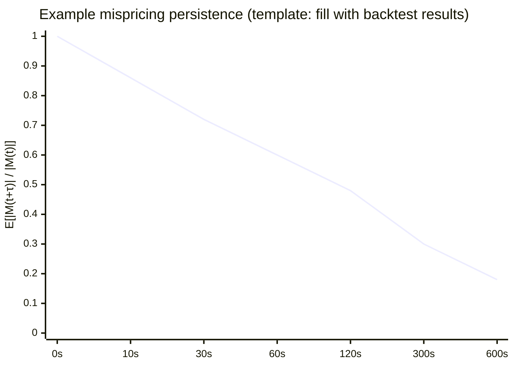
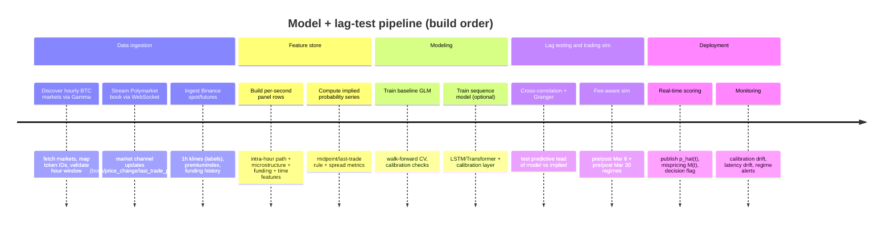

# Estimating the True Probability of an Up-Closing BTC/USDT Hour and Testing Lead–Lag vs Polymarket Implied Probabilities

## Executive summary

The modeling goal is to estimate, in real time, the conditional probability that the **BTC/USDT 1‑hour candle closes Up (close ≥ open)** given the **intra-hour price path** and related market state, then test whether **Polymarket implied probabilities** (derived from the order book midpoint / best bid-ask / last trade when spreads are wide) **systematically lag** your estimated probability. citeturn11view4turn11view3turn10search8turn6search0

A rigorous approach requires (a) strict timestamp alignment to Binance hour opens/closes for labeling, (b) a high-frequency panel dataset within each hour that uses only information available at the time, (c) probability-calibrated models evaluated with proper scoring rules (not just accuracy), and (d) explicit lead–lag tests (Granger causality, cross-correlation, and event studies near close). citeturn13search0turn4search2turn4search5turn4search1

Because Polymarket’s displayed “probability” is tied to limit-order-book mechanics—midpoint unless the spread exceeds $0.10, then last trade—and because order book updates arrive via WebSocket messages (book, price_change, last_trade_price, etc.), you should treat implied probability as a microstructure-measured series that can be compared against your model’s “fundamental” estimate at a matched cadence. citeturn11view3turn10search8turn12view2turn12view0

Any “actionable” trading test must be fee- and spread-aware across regimes: Polymarket’s docs show that crypto taker fees changed scope on **March 6, 2026** (covering all newly created crypto markets including 1H) and are scheduled to change parameters on **March 30, 2026**, with an explicit probability-dependent fee curve. citeturn5view1turn6view3turn6view1 The practical threshold for action is therefore not “mispricing > 0,” but “mispricing > execution friction,” where frictions include spread, slippage, and (if taking) taker fees computed from the documented formula. citeturn6view1turn11view3turn7view1

## Modeling goal and lead–lag hypothesis

### Precise modeling objective

Define an hourly interval \(h\) with open time \(t_0\) and close time \(t_1=t_0+3600s\). Let \(O_h\) and \(C_h\) be the **Binance** BTC/USDT open and close for that hour. The label is:

\[
Y_h = \mathbb{1}[C_h \ge O_h]
\]

You aim to produce a real-time probabilistic forecast \( \hat{p}(t)=\mathbb{P}(Y_h=1 \mid \mathcal{I}_t ) \) for timestamps \(t \in [t_0, t_1)\), where \(\mathcal{I}_t\) includes only information available up to time \(t\): intra-hour path features, derivatives signals (funding/basis proxies), and Polymarket microstructure signals if you want to test a joint information set. citeturn11view4turn11view6turn12view2

### Defining Polymarket implied probability as an observable time series

Polymarket’s displayed price is defined as the midpoint of the bid-ask spread unless the spread exceeds $0.10, in which case it shows last traded price; the docs also present the interpretation “prices = probabilities.” citeturn11view3turn10search8turn10search2 You should therefore define an implied probability series \(p_{PM}(t)\) using orderbook-derived primitives, e.g.:

- If \(a_t-b_t \le 0.10\), \(p_{PM}(t) = \frac{a_t+b_t}{2}\)  
- Else, \(p_{PM}(t) = \text{last\_trade\_price}(t)\)

This matches the platform’s own display logic and ensures your “lag tests” compare like with like. citeturn11view3turn10search8turn10search5

### Lead–lag hypothesis and what “lag” means operationally

You are testing whether the market price process tends to **move toward** your conditional probability estimate with a measurable delay. A concrete lead–lag hypothesis can be formulated as:

\[
\Delta p_{PM}(t+\tau) = \alpha + \beta \left(\hat{p}(t)-p_{PM}(t)\right) + \gamma \Delta p_{PM}(t) + \varepsilon_t
\]
with \(\beta>0\) for some small horizons \(\tau\) (e.g., 10s–300s), meaning positive mispricing predicts upward future market moves. This can be tested via cross-correlation, event studies, and Granger causality (forecasting-and-causality framework). citeturn4search2turn12search1

## Data sources and prioritized endpoints

Polymarket’s docs describe three APIs (Gamma, Data, CLOB) and emphasize that market data endpoints are public, while trading endpoints are authenticated with L2 headers; they also explicitly document WebSocket channels for near real-time orderbook and trade data. citeturn11view2turn3search16turn5view3turn12view0 Binance documents the spot kline endpoint for 1h candles and the futures endpoints needed for funding/mark price features. citeturn11view4turn11view5turn11view6

### Prioritized data sources table with exact endpoints and key fields

| Priority | Source | Endpoint / feed | Key fields to fetch | Cadence | Primary use |
|---:|---|---|---|---|---|
| 1 | Binance spot | `GET /api/v3/klines` | `openTime`, `open`, `high`, `low`, `close`, `volume`, `closeTime` (and symbol/interval params) | Historical + near-real-time | Ground-truth label \(Y_h\) and intra-hour path features. citeturn11view4 |
| 2 | Polymarket CLOB WebSocket (market channel) | `wss://ws-subscriptions-clob.polymarket.com/ws/market` | Message types: `book`, `price_change`, `last_trade_price`, `tick_size_change`, `best_bid_ask`; each message includes fields like `bids/asks`, `price_changes`, `best_bid/best_ask`, `timestamp` | Real-time | Implied probability series and microstructure features; measure lags. citeturn12view0turn12view2 |
| 3 | Polymarket CLOB REST | `GET /book?token_id=...` | `bids[{price,size}]`, `asks[{price,size}]`, `timestamp`, `tick_size`, `last_trade_price` | Snapshot / backfill | Orderbook snapshots for feature store and backtests. citeturn7view1turn7view0 |
| 4 | Polymarket Gamma REST (market discovery) | `GET /markets` | `id`, `slug`, `conditionId`, `outcomes`, `outcomePrices`, `volume`, `active`, `closed`, plus filters (e.g., `condition_ids`, `clob_token_ids`, `volume_num_min/max`) | Hourly / daily | Identify the correct hourly BTC Up/Down markets and token IDs; universe definition. citeturn9view0turn9view1 |
| 5 | Polymarket Data API (trades) | `GET https://data-api.polymarket.com/trades` | `conditionId`, `side`, `size`, `price`, `timestamp`, `transactionHash`, plus query params (e.g., `market`, `eventId`, `takerOnly`) | Backtest + monitoring | Trade tape for “who moved first” tests; competitor/volume diagnostics. citeturn8view0turn8view1 |
| 6 | Binance USDⓈ-M futures | `GET /fapi/v1/premiumIndex` | `markPrice`, `indexPrice`, `lastFundingRate`, `nextFundingTime`, `time` | Real-time | Funding/basis proxies as features; regime shifts. citeturn11view6 |
| 7 | Binance USDⓈ-M futures | `GET /fapi/v1/fundingRate` | `fundingRate`, `fundingTime`, `markPrice` (with `startTime/endTime/limit`) | Batch | Funding history features and volatility regime inference. citeturn11view5 |
| 8 | Polymarket fees & fee enabling | `GET /fee-rate?token_id=...` + market object `feesEnabled` | `feeRateBps` / non-zero fee rate; fee regime mapping | Per market + daily | Fee-aware trade simulation and regime splits. citeturn6view0turn6view1 |
| 9 | On-chain fills | Exchange `OrderFilled` event (address list via docs) | `orderHash`, `maker`, `taker`, `makerAssetId`, `takerAssetId`, `makerAmountFilled`, `takerAmountFilled`, `fee` | Backtest audit | Independent verification of executed trades and fees. citeturn15view0turn15view1 |
| 10 | Polymarket leaderboard (competition proxy) | `GET /leaderboard` (Data API) | `rank`, `proxyWallet`, `vol`, etc. | Daily | Competitor concentration + maker share assumptions. citeturn2search2 |
| 11 | Polymarket geo restrictions checks | Geo restriction guidance | “Orders from blocked regions rejected; verify location” | As needed | Compliance gates in pipeline. citeturn11view7turn3search1 |

## Feature engineering and target construction

### Core alignment and panel structure

Construct a panel dataset with observations at a chosen sampling interval \(\Delta t\) (e.g., 1s–10s). For each hour \(h\) and timestamp \(t\in[t_0, t_1)\), store a row with:
- Label \(Y_h\) (known only after \(t_1\))  
- Feature vector \(x(t)\) built solely from information available up to \(t\)  

This avoids lookahead and supports time-to-close interaction effects. citeturn11view4turn4search1

### Price-path features from Binance spot klines

Compute features based on the evolving price relative to the hour’s open:

- **Distance-to-open**: \(d(t)=\ln(P_t/O_h)\)  
- **Realized volatility** over multiple windows (e.g., 1m, 5m, 15m): \(RV_w(t)=\sum_{i\in w} r_i^2\), where \(r_i\) are intraminute log returns computed from fine-grained prices derived from klines or higher-frequency spot data (if you ingest it).  
- **Momentum / trend**: recent return slopes, rolling z-scores of returns vs recent volatility, and “sign persistence” (fraction of positive returns in last \(w\) seconds).  

These are standard intraday predictors for short-horizon binary outcomes, and they are consistent with the contract’s “close vs open” settlement rule. citeturn11view4turn6search0

### Perp funding / basis proxies from Binance USDⓈ-M futures

Use futures-provided fields as informational features:
- **Latest funding rate** and its sign/magnitude (`lastFundingRate`) as a sentiment/carry proxy. citeturn11view6  
- **Funding history**: rolling averages / changes in `fundingRate` and the distribution of `fundingRate` across recent funding times. citeturn11view5  
- **Premium / basis proxy**: `markPrice - indexPrice` (and scaled variants) from `premiumIndex` as a real-time basis indicator. citeturn11view6  

### Polymarket microstructure features from CLOB order book and WebSockets

Use the orderbook schema (bids/asks price levels and sizes) and WebSocket event types to build microstructure features:

- **Implied probability series** \(p_{PM}(t)\) as midpoint vs last-trade fallback when spread > $0.10. citeturn11view3turn10search8  
- **Spread**: \(s(t)=a(t)-b(t)\) computed from best ask/bid, consistent with docs that define spread as best ask minus best bid. citeturn10search10turn7view1  
- **Order book imbalance** (top-of-book or within price bands):  
  \[
  I_{\Delta}(t)=\frac{\sum_{p\in[b(t),b(t)+\Delta]} \text{size}_{bid}(p)\;-\;\sum_{p\in[a(t)-\Delta,a(t)]}\text{size}_{ask}(p)}{\sum \text{size}_{bid}+\sum \text{size}_{ask}}
  \]
  Depth levels come from the `book` message or `/book` endpoint’s `bids`/`asks` arrays. citeturn12view0turn7view1  
- **Microstructure update lags**:  
  - time since last `price_change` event (new order/cancel) citeturn12view2  
  - time since last `last_trade_price` event (executed trade) citeturn12view2  
  - tick-size regime: track `tick_size_change` events and current `tick_size`; docs explicitly state tick size changes when price reaches extremes (>0.96 or <0.04). citeturn12view2turn7view1  

### Time-of-day and hour-structure features

Include hour-of-day and day-of-week indicators because intraday volatility and liquidity regimes differ by time. This is especially relevant if you trade a fixed window (e.g., 8–9am), and it is straightforward to do without leakage. (This is a modeling design choice; validate in-sample/out-of-sample.) citeturn11view4turn4search1

## Model choices, calibration, and comparison plan

The target is a calibrated probability \( \hat{p}(t)\). Proper scoring rules and calibration diagnostics are necessary: the Brier score was introduced for verifying probabilistic forecasts, and proper scoring rules are the standard framework for evaluating probabilistic predictions. citeturn13search0turn4search1turn4search5 Reliability diagrams are a key diagnostic for calibration, plotting observed frequencies vs predicted probabilities. citeturn4search5turn4search9

### Model comparison table

| Model family | Input granularity | Output | Strengths | Weaknesses / failure modes | Calibration approach |
|---|---|---|---|---|---|
| Logistic regression / GLM | Snapshot features at \(t\) | \(\hat{p}(t)\) | Interpretable, fast, robust baseline; easy to add interactions (time-to-close × distance-to-open) | Linear decision surface; may miss nonlinear microstructure effects | Native log-loss optimization; can add isotonic/Platt if needed. citeturn4search1turn14search0 |
| Time-series GLM (with lagged terms) | \(x(t)\) plus lags \(x(t-\ell)\) | \(\hat{p}(t)\) | Captures inertia and microstructure lag explicitly; strong baseline for lead–lag tests | Overfitting risk if many lags; needs careful time-series CV | Post-hoc calibration with Platt or isotonic. citeturn14search0turn14search11 |
| Survival / hazard-style model (“Up event survives until close”) | Continuous time-to-close structure | \(\hat{p}(t)\) | Natural handling of time-to-close and path dependence; can produce smoothly updating probabilities | More complex; needs clear event definition and consistent censoring | Calibrate with reliability or proper scoring rules. citeturn4search1turn4search9 |
| Point-process / Hawkes for order flow + state model | Order-flow events (price_change, trades) | Flow intensity + implied probability dynamics | Strong for microstructure dynamics; Hawkes processes widely used in HF finance for event clustering and orderbook dynamics | Implementation complexity; heavy data requirements; needs stable event definitions | Calibrate probability layer separately; evaluate with proper scoring rules. citeturn13search2turn12view2turn4search1 |
| LSTM probabilistic model | Sequential features (1–10s cadence) | \(\hat{p}(t)\) | Captures nonlinear temporal patterns and regime shifts | Harder to interpret; can overfit; needs careful leakage control | Explicit calibration layer or temperature scaling / isotonic on outputs. citeturn4search1turn4search5turn14search11 |
| Transformer with probabilistic head | Longer context windows | \(\hat{p}(t)\) | Strong at long-range dependencies; can incorporate multiple modalities (path + orderbook) | Heavy compute; retraining latency; risk of unstable calibration | Temperature scaling; reliability diagrams; Brier/log score evaluation. citeturn4search1turn4search5turn14search11 |

### Calibration and evaluation methods

Use at least four complementary probability-quality tools:

- **Brier score**: a classic verification score for probability forecasts introduced by entity["people","Glenn W. Brier","meteorologist 1950 paper"]. citeturn13search0turn4search1  
- **Log loss (cross-entropy)**: a strictly proper scoring rule in the proper-scoring framework (encourages truthful probabilities). citeturn4search1turn4search9  
- **Reliability diagrams** (and stability-enhanced variants) as calibration diagnostics. citeturn4search5turn4search24  
- **Post-hoc calibration**: Platt scaling (sigmoid calibration) and isotonic methods are standard for improving probability calibration. citeturn14search0turn14search11  

Cross-validation must respect temporal structure: use time-based splits (walk-forward or blocked CV), and never mix future samples into training for earlier timestamps. This aligns with the causal and forecasting setup used in time-series lead–lag tests. citeturn4search2turn4search1

## Backtest design, lag tests, and expected outputs

### Backtest alignment and lookahead avoidance

Core rules:

- Label each hour using Binance 1h klines (open and close by hour open time). Binance notes klines are uniquely identified by their open time, which is helpful for deterministic labeling. citeturn11view4  
- When using Polymarket markets, map each “hourly BTC Up/Down” market to the correct Binance hour window using the market’s hour and its resolution rule (the market pages for these contracts explicitly cite the Binance BTC/USDT 1H candle open/close condition). citeturn6search0turn10search25  
- At timestamp \(t\), only use Polymarket book states and trade events with timestamps ≤ \(t\) and only Binance price information ≤ \(t\). The Polymarket market channel includes explicit `timestamp` fields in each message type. citeturn12view2turn12view0  

### Fee-aware trade simulation across March 6 and March 30 regimes

Polymarket’s changelog states that starting **March 6, 2026**, taker fees and maker rebates extend to all newly created crypto markets including 1H; only markets created after March 6 are affected. citeturn5view1 Polymarket’s fees page states new fee parameters take effect March 30, 2026 and provides the fee formula and current/upcoming fee parameters for crypto. citeturn6view1turn6view3

To implement a correct regime map:

- For each market token, read `feesEnabled` from market object and/or call the fee-rate endpoint (`GET /fee-rate?token_id=...`), which the docs recommend for checking fee enablement; fee-enabled returns non-zero and fee-free returns 0. citeturn6view0turn6view1  
- Use “current” vs “upcoming” parameters based strictly on timestamps (pre/post Mar 30) and feeEnabled status. citeturn6view1  

A fee-aware taker trade simulation uses the documented fee function:
\[
\text{fee} = C \times p \times feeRate \times (p(1-p))^{exponent}
\]
where \(C\) is shares and \(p\) is price. citeturn6view1turn6view3

### Spread and slippage modeling

Polymarket implied price is midpoint unless spread > $0.10 then last trade. citeturn11view3turn10search8 But execution uses the book, so you should simulate:

- **Taker execution** at best ask for buys / best bid for sells (plus deeper levels for larger sizes, using `/book` `bids/asks` arrays). citeturn7view1turn7view0  
- **Maker execution** by placing post-only at/inside the best levels and modeling fill probability as a function of queue position and observed trade flow (from market channel `last_trade_price` events and Data API trades). citeturn12view2turn8view1turn21view0  

### Statistical tests for lag

Use multiple, mutually reinforcing tests:

- **Lead–lag cross-correlation**: compute correlation between mispricing \(M(t)=\hat{p}(t)-p_{PM}(t)\) and future price changes \(\Delta p_{PM}(t+\tau)\) across horizons \(\tau\).  
- **Granger causality**: test whether \(M(t)\) (or \(\hat{p}(t)\)) improves prediction of future \(p_{PM}\) beyond lagged \(p_{PM}\) terms; grounded in the original Granger causality framework. citeturn4search2  
- **Event study near close**: compute average response of \(p_{PM}\) to mispricing shocks in windows like T-10m, T-5m, T-1m, because market informativeness often spikes near settlement. This is also where microstructure lags can matter most. citeturn12search1turn6search0  

### Evaluation metrics to report

Model quality:
- **Brier score** (and optionally decompositions such as reliability/resolution) for binary probabilistic accuracy. citeturn13search0turn14search2  
- **AUC** (ranking ability) as a supplemental metric; do not treat as a substitute for calibration. (AUC is common; calibration still must be verified.) citeturn4search5turn4search1  
- **Reliability diagrams** and quantitative calibration error summaries. citeturn4search5turn4search24  

Trading relevance:
- **Expected value after fees and spread**: simulate net EV using the documented fee curve and book-derived slippage. citeturn6view1turn7view1turn11view3  
- **Hit rate by decile**: bucket predictions into deciles, compute realized Up frequency per decile (a reliability-style diagnostic tied to decision thresholds). citeturn4search5turn4search9  
- **Mispricing persistence half-life**: estimate an AR(1) or survival-style decay of \(M(t)\) to compute time for mispricing to shrink by 50% (operationally: how long a “lag edge” tends to remain exploitable). citeturn4search2turn4search1  

### Expected outputs (templates)

A typical “mispricing persistence” output you want is a curve of average absolute mispricing remaining after \(\tau\) seconds, conditional on initial mispricing size.



The shape above is illustrative; your actual chart should be computed from out-of-sample residual mispricing series \(M(t)\) reconstructed from timestamp-aligned model predictions and orderbook-implied probabilities. citeturn12view2turn11view3turn4search2

## Implementation pipeline, latency targets, and actionable decision thresholds

### End-to-end pipeline timeline



This design relies on Polymarket’s WebSocket market channel and its documented message types and endpoints, keeping your implied probability construction consistent with platform definitions. citeturn12view0turn12view2turn11view3

### Practical ingestion + trading constraints you must engineer around

- Polymarket’s rate limits are enforced through entity["company","Cloudflare","web security company"] throttling and can delay/queue requests; this matters for “time-to-close” lag studies because delayed cancels/requotes can create artificial lag in your own execution tests. citeturn0search20turn23view0  
- The matching engine restarts weekly Tuesday 7:00 AM ET and order endpoints return HTTP 425 during restarts; your modeling pipeline should flag those windows as “data quality risk” for microstructure-based tests. citeturn5view7turn22view0  
- If you later test a maker strategy, heartbeat behavior cancels open orders if a valid heartbeat is not received within ~10 seconds (with buffer), so execution experiments must log heartbeat status as a confounder in PnL attribution. citeturn15view0turn21view0  

### Actionable thresholding after fees and spreads

Let \(p=\) current executable price (ask for BUY, bid for SELL). For a taker BUY of \(C\) shares, with fee function from docs, the USDC fee is:
\[
fee = C \cdot p \cdot feeRate \cdot (p(1-p))^{exponent}.
\]
citeturn6view1turn6view3

You should require a minimum edge that clears:
- half-spread (if using midpoint as reference) or full spread (if crossing),
- depth slippage from book levels,
- taker fee (if applicable; check `feesEnabled` / fee-rate endpoint). citeturn11view3turn7view1turn6view0

A practical “decision rule” is expressed as a minimum mispricing threshold:
\[
M(t)=\hat{p}(t)-p_{PM}(t)
\]
Trigger only if:
\[
|M(t)| \ge \theta(t)= \underbrace{\frac{s(t)}{2}}_{\text{spread}} + \underbrace{\text{slippage}(C)}_{\text{book depth}} + \underbrace{\text{fee\_edge}(p,C)}_{\text{taker fee}} + \underbrace{\epsilon}_{\text{model risk buffer}}
\]
where \(s(t)\) is best ask minus best bid (orderbook spread). citeturn10search10turn7view1turn6view1

In a maker-leaning version of the strategy, you can reduce the “fee_edge” term (post-only) but must add a fill-probability discount and adverse-selection penalty; those are estimated from historical trade arrival intensity and state-dependent toxicity (often strongest near close). citeturn12view2turn13search1

### Pseudocode for training and lag-testing/backtesting

```text
1) Universe + mapping
  - Pull candidate markets from Gamma /markets with filters (active/slug/volume ranges).
  - For each market: extract conditionId + token IDs.
  - Map market hour window -> Binance klines openTime/closeTime for BTCUSDT 1h.

2) Build panel dataset (per hour h)
  For each hour h:
    - Load Binance spot path P(t) within the hour (or fine-grained proxy).
    - Ingest Polymarket WS or /book snapshots -> derive b_t, a_t, last_trade(t), spread s(t).
    - Ingest futures premiumIndex + funding offsets -> align by timestamp.
    - For each timestamp t (every Δt):
        x(t) = {distance-to-open, RV windows, momentum, funding metrics,
                orderbook imbalance, spread, microstructure update lags, time-of-day}
        y = 1 if close>=open else 0

3) Train models (walk-forward)
  - Split by date (e.g., train on weeks 1..k, validate on week k+1).
  - Fit baseline GLM; compute p_hat(t).
  - Fit sequence model optionally; compute p_hat(t).
  - Apply probability calibration (Platt or isotonic) on validation folds.

4) Evaluate forecasting
  - Compute Brier score, log loss, AUC, reliability diagrams.
  - Compute decile hit rates and calibration curves.

5) Lead–lag tests
  - Define implied p_PM(t) from midpoint/last-trade rule.
  - Mispricing M(t)=p_hat(t)-p_PM(t).
  - Cross-correlation: corr(M(t), Δp_PM(t+τ)) for τ>0.
  - Granger: regress p_PM changes on lags of p_PM and lags of p_hat (or M).

6) Fee-aware trading backtest (optional but recommended)
  For each t:
    - Determine fee regime for token (feesEnabled or fee-rate endpoint).
    - Compute executable price from order book + slippage size model.
    - If |M(t)| > θ(t): simulate trade (taker or maker).
  - Report net PnL distribution, EV after fees, p70 outcomes by scenario.
```

Calibration and scoring evaluation are grounded in proper scoring rules literature and the original probabilistic forecast verification framework. citeturn4search1turn13search0turn14search0turn14search11

## Sensitivity analyses, scenario tables, and limitations/compliance

### Feature ablation and regime slicing

Do not treat “one global model” as final; you should report performance slices by:

- Volatility regime: buckets by realized volatility or by futures mark/index deviations. citeturn11view6turn13search2  
- Liquidity regime: buckets by Polymarket spread and depth (from `/book` bids/asks and spreads). citeturn7view1turn10search10  
- Time-to-close: evaluate edge persistence in early hour vs last 10 minutes, where toxicity and microstructure lags can differ sharply. citeturn13search1turn12view2  

### Backtest scenario table with expected p70 outcomes (template + modeling assumptions)

Because exact reward pools and maker share are unspecified, treat them as parameter ranges, and report p70 outcomes **as model-implied outputs** under transparent assumptions (volume, execution model, fee regime). Fee regimes are anchored to March 6 coverage expansion and March 30 parameter update in official docs. citeturn5view1turn6view3turn6view0

| Scenario | Hourly PM volume (USD) | Maker share (if maker) | Fee regime | Strategy type | Expected p70 (net USDC/hour) |
|---|---:|---:|---|---|---:|
| A | 50k | 3% | Fees off (feesEnabled=0) | Taker threshold | Fill from book; friction mostly spread/slippage |
| B | 150k | 0% | Fees on, pre‑Mar 30 (0.25, exp 2) | Taker threshold | Reduced vs A due to taker fee curve near 50% citeturn6view3 |
| C | 150k | 7% | Fees on, pre‑Mar 30 | Maker-leaning | p70 depends on fill model + adverse selection; no taker fee but lower fill certainty citeturn12view2turn13search1 |
| D | 150k | 0% | Fees on, post‑Mar 30 (0.072, exp 1) | Taker threshold | Lower net unless mispricing persistence is strong enough to clear higher peak effective rate citeturn6view3 |
| E | 300k | 10% | Fees on, post‑Mar 30 | Maker-leaning | Potentially higher due to higher flow; must validate against toxicity near close citeturn12view2turn13search1 |

Populate the “Expected p70” column by running the backtest simulator with your estimated mispricing persistence + execution model; the table structure is what stakeholders will want for decision-making clarity.

### Limitations and risks

**Causal ambiguity**: Even if mispricing predicts future price changes, the relationship may reflect shared reactions to external BTC moves rather than a true “market lag”; Granger causality is a forecasting tool and not definitive proof of causal mechanism. citeturn4search2turn4search21

**Microstructure measurement error**: Polymarket’s displayed probability uses midpoint or last trade depending on spread. In illiquid moments, last-trade-based implied probability can jump and distort lag measures unless you explicitly account for the spread>0.10 rule and use orderbook-consistent definitions. citeturn11view3turn10search8turn7view1

**Regime instability**: Fee scope and parameters changed (March 6 expansion; March 30 update), and fee-enabled status should be determined per market via `feesEnabled` or fee-rate endpoint. Any performance estimate that ignores this will be biased. citeturn5view1turn6view0turn6view3

**Compliance**: Polymarket documents geographic restrictions: orders from blocked regions are rejected and builders should verify location before submitting orders. The help center states VPN use to bypass geo restrictions is prohibited. citeturn11view7turn3search1

```text
Key official docs / repos / endpoints (reference list)

Polymarket docs:
https://docs.polymarket.com/trading/fees
https://docs.polymarket.com/changelog
https://docs.polymarket.com/api-reference/markets/list-markets
https://docs.polymarket.com/api-reference/market-data/get-order-book
https://docs.polymarket.com/market-data/websocket/market-channel
https://docs.polymarket.com/api-reference/core/get-trades-for-a-user-or-markets
https://docs.polymarket.com/api-reference/rate-limits
https://docs.polymarket.com/trading/matching-engine
https://docs.polymarket.com/trading/orders/overview
https://docs.polymarket.com/resources/contract-addresses
https://docs.polymarket.com/api-reference/geoblock

Polymarket SDKs:
https://github.com/Polymarket/clob-client
https://github.com/Polymarket/py-clob-client
https://github.com/Polymarket/real-time-data-client

Binance APIs:
https://developers.binance.com/docs/binance-spot-api-docs/rest-api/market-data-endpoints
https://developers.binance.com/docs/derivatives/usds-margined-futures/market-data/rest-api/Mark-Price
https://developers.binance.com/docs/derivatives/usds-margined-futures/market-data/rest-api/Get-Funding-Rate-History
```